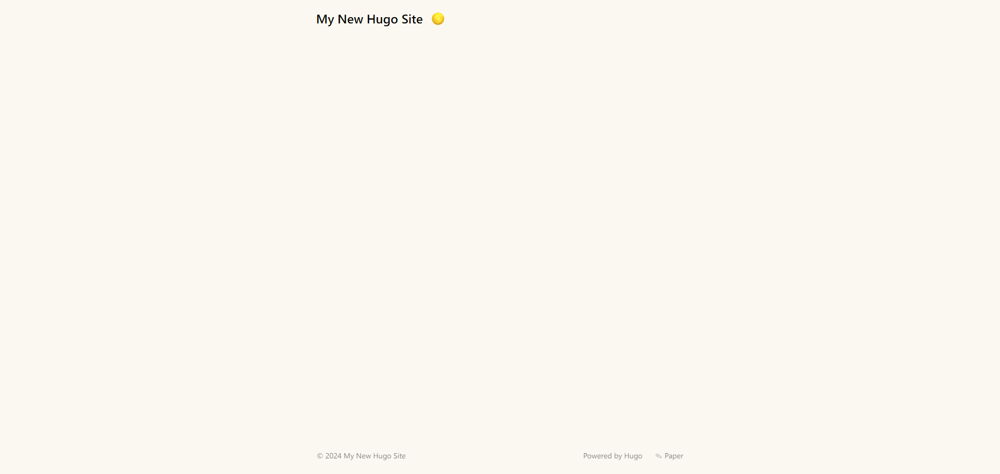

ブログに利用しているSSGをHugoに移行したので記事にします。

## Hugoとは
Goで書かれた「ウェブサイトを構築するための世界最速のフレームワーク」 (gohugo.ioより)らしいです。

### テーマ
[公式サイト](https://themes.gohugo.io/)はあまりおすすめしません。人気順に出来なかったりします。[GitHubのトピック](https://github.com/topics/hugo-theme)で探すのが個人的におすすめです。

このブログでは[Stack](https://github.com/CaiJimmy/hugo-theme-stack)を利用しています。
### プラグイン (アドオン)
Hugoにそれらしき項目は見当たりませんでした。
でも、標準でサイトマップなどを生成することができるので機能には困らないと思います。

### 構築
> ほとんど[Hugoのドキュメント](https://gohugo.io/getting-started/quick-start/)からの抜粋です。
#### 必要なもの
* Git
#### インストール
ここではWindowsで利用する場合の手順を書きます。他のOSの場合は[公式サイト](https://gohugo.io/installation/)から確認してください。

##### scoopを使う (推奨)
scoopを使う場合は、勝手にパスが通るのでおすすめです。

以下のコマンドを実行してください。
```sh
scoop install hugo
```
#### サイトを作成する
{}
⚠ **注意**

Windowsユーザーの場合はWindows PowerShellやコマンドプロンプトは利用しないで[PowerShell](https://learn.microsoft.com/en-us/powershell/scripting/install/installing-powershell-on-windows?view=powershell-7.4)や[Git Bash](https://gitforwindows.org/)を利用してください。

※ここで言う[PowerShell](https://learn.microsoft.com/en-us/powershell/scripting/install/installing-powershell-on-windows?view=powershell-7.4)はWindows PowerShellとは異なるアプリケーションです。
{}

以下のコマンドを実行してHugoでウェブサイトを作成します。
```
hugo new site hugo-site
```
作成後、以下のコマンドで作成したウェブサイトのディレクトリに移動します。
```
cd hugo-site
```
ディレクトリはこのような構造になっていると思います。
```
.
├── archetypes
│   └── default.md
├── assets
├── content
├── data
├── i18n
├── layouts
├── static
├── themes
└── hugo.toml
```

この状態で`hugo serve`を実行しても何もでてきません (正確にはPage Not Foundと表示されます)。なのでテーマなどを入れます。
##### テーマを導入する
今回は[Paper](https://github.com/nanxiaobei/hugo-paper)を導入します。

まず、ディレクトリにGitリポジトリを作成するために、`git init`を実行します。

実行後、以下のコマンドを実行してください。
```sh
git submodule add https://github.com/nanxiaobei/hugo-paper themes/paper
```
操作が正しく完了している場合はディレクトリ内にthemesフォルダが作成されているはずです。次に、hugo.tomlの`theme`という項目を以下のように書き換えます。
```toml
theme = "paper"
```
導入後、再度`hugo serve`を実行して以下のような画面が表示されるか確認してください。


表示された場合は次に進んでください。
##### サイトの設定を変更する
baseurlを変更します。これが正しく設定されていないと、表示が崩れるので必ず変更してください。

`hugo.toml`を開きます。以下のようになっている部分を書き換えてください。
```diff
- baseURL = 'https://example.org/'
+ baseURL = 'ウェブサイトのURL'
```

次に、ウェブサイトのページ名(`My New Hugo Site`となっている部分です)を変更します。同じく`hugo.toml`内のtitleを書き換えてください。
#### 記事を追加する
以下のコマンドを実行することで記事を追加することが出来ます。
```
hugo new content posts/タイトル/index.md
```
するとcontentフォルダにpostsフォルダが作成されます。そのフォルダの中に記事のフォルダが格納されます。

作成された.mdのファイルを開いてください。以下のようなテキストが記述されているはずです。
```md
+++
title = 'はろーわーるど'
date = 2024-04-27T21:41:06+09:00
draft = true
+++
```
titleには記事のタイトル、draftはfalseにするとサイト上に表示されるようになります。

##### URLにタイトルが使われないようにする
`example.com/blog/はろーわーるど`のようになるのは格好悪いのでURLに記事名以外のテキストを設定します。

設定するには、以下のようにファイルを編集します。
```diff
+++
title = 'はろーわーるど'
date = 2024-04-27T21:41:06+09:00
draft = true
+ slug = "HelloWorld"
+++
```
するとさっきまで`example.com/blog/はろーわーるど`のように日本語が使用されていたURLが`example.com/blog/HelloWorld`のように変化します。

#### ウェブサイトをビルドする
以下のコマンドを実行してください。
```
hugo --minify --gc
```
するとpublicフォルダにhtmlが生成されているはず(`hugo serve`などを実行している場合はすでにあるものが置き換えられている)です。
### カスタマイズする
Hugoはテーマ自体をカスタマイズすることが可能です。

この辺りはうまく説明しきれないので検索してください。

### 自分で指定したrobots.txtを使う
`hugo.toml`の`enableRobotsTXT`を`true`に変更(もしくは新しく値を追加)後、
layoutsフォルダにrobots.txtを作成することで指定したrobots.txtを利用することが出来ます。