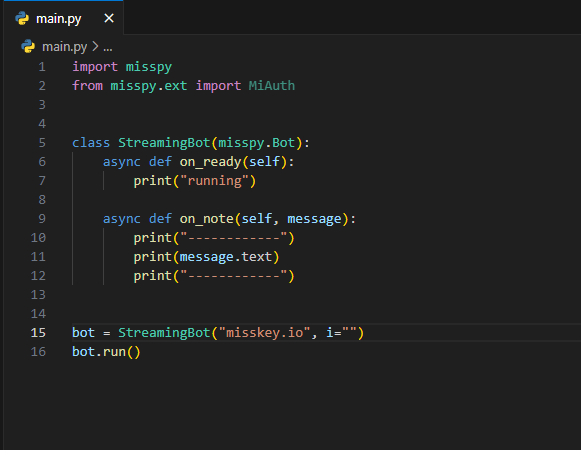

> この記事は[Misskey Advent Calendar 2023
](https://adventar.org/calendars/8742)の24日目の記事です。

## はじめに
僕は[misspy](https://misspy.xyz)というライブラリを書いています。 今回はそのmisspyについて書いていこうと思います。

<small><small>えっ？<a href="https://misskey.io/notes/9fjxmyzzec">別の名前のライブラリ</a>作ってたじゃないかって？<s><a href="https://github.com/yupix/MiPAC">このライブラリ</a>と名前が紛らわしいから消しました...(ちなみに[Misskey Advent Calendar 9日目](https://zenn.dev/yupix/articles/2ff668232f1ef3)の方です)</s></small></small>

## なんで作った
なぜ作ったかを簡単に言うと、**Misskey.pyが非同期処理に対応していないから**(4.1.0現在)です。

別にそれだけなら外部で実装すればいいんですけど、僕は面倒臭いので自分でライブラリごと作ることにしました。それに、一から自分で作ったほうが自分が思うように作れるので。(コードがいまいちわからないもの(ほかの方が作ったライブラリとか)を改造することは苦手なんです...)

## misspyのソースコードについて
#### 最初期のmisspyのコード


※これは何も出力しません。タイムラインに接続してないので。

最初期のmisspyは今のような形式ではなく、classに特定の名称の関数を作成してその下にコードを書く**脳筋実装**でした。また、httpxを非同期リクエストに利用していたので今より多少速度は遅かったと思います。

当時の僕はクラス式の実装(?)に納得がいかなかったみたいで、新しく[hook](https://github.com/misspy-dev/misspy/blob/master/misspy/hook.py)っていうクラスを追加しました。

リクエスト部分とWebSocket部分を[misspy-dev/core](https://github.com/misspy-dev/core)に移動して、httpの非同期リクエスト部分をaiohttpに置き換えて高速化しました。websocketはaiohttpが対応していたのですが、調子が良くないので今のところwebsocketsを利用しています。

だけど、当時の僕はそれに納得がいかなかったみたいで、新しく[hook](https://github.com/misspy-dev/misspy/blob/master/misspy/hook.py)っていうクラスを追加しました(何で！？)。これもやっぱり脳筋実装です。
### 現在
```python
import misspy

bot = misspy.Bot("misskey.io", "")

async def on_ready():
    await bot.connect(misspy.localTimeline)

async def on_note(ctx, message):
    print("------------")
    print(message)
    print("------------")

bot.add_hook("ready", on_ready)
bot.add_hook("note", on_note)

bot.run()
```

いろいろした結果、こんな感じになりました。
ちなみに、こんな構造になったことで、別のファイルに関数を分けておくことができるようになりました。
ただし、botにアクセスできないと何もできないので、ちょっと改良中です。

## 今後やりたいこと
今後は、上に書いたように、discord.pyのCogsとextensionのように別ファイルでもbotを利用できるようにしたりしたいと思います。
